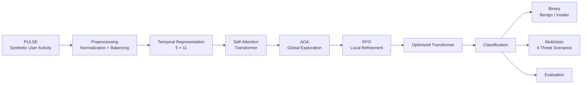

# DMA-PULSE

### Scenario-Driven Insider Threat Detection Using Dual Modelling Architecture

> **Published research** - a hybrid Transformer-based framework combining self-attention with sequential metaheuristic optimization for scenario-driven insider threat detection.

[](#publication)
[](#)
[](#)
[](#)
[](#)

## Overview

DMA-PULSE proposes a **Dual Modelling Architecture (DMA)** for detecting anomalous insider activity from scenario-driven user-behavior sequences. The framework combines a self-attention Transformer with a two-stage optimization strategy: **Archimedes Optimization Algorithm (AOA)** for global exploration followed by **Red Fox Optimization (RFO)** for local refinement.

The experiments use **PULSE (Profile-based User Logs for Synthetic Evaluation)**, a synthetic scenario-driven insider-activity dataset. The published study evaluates both binary insider-threat detection and multiclass discrimination across four threat scenarios.

## Architecture



The architecture follows the methodology described in the publication: preprocessing and temporal sequence construction feed a self-attention Transformer, whose sensitive hyperparameters are optimized sequentially using AOA and RFO before classification.

## Dataset

PULSE contains **14,010 activity sequences**, each represented by **11 feature dimensions across five sequential time steps**. The published dataset is synthetically generated from scenario-driven user activity representing benign, suspicious, and malicious behavior.

The feature space includes behavioral, activity, resource, and temporal signals. The multiclass labels represent four scenarios: logon/logoff frequency, file access activity, removable-media usage, and process execution.

The raw PULSE dataset is **not included** in this repository.

## Methodology

### 1. Data preprocessing

The published workflow removes incomplete or corrupted records, normalizes timestamps, maps user identities consistently, applies one-hot encoding to categorical attributes, and Min–Max normalizes continuous attributes. The resulting representation is **[14010, 5, 11]**. Class imbalance is addressed through minority-class oversampling and majority-class undersampling.

### 2. Self-attention Transformer

Each temporal sequence is embedded and combined with positional information. Multi-head self-attention models relationships across the activity window, followed by feed-forward processing and classification.

### 3. Hybrid AOA–RFO optimization

The optimization stage is sequential:

- **AOA** performs coarse global exploration of sensitive Transformer hyperparameters such as learning rate, attention heads, embedding size, and dropout.
- **RFO** starts from the AOA-derived search region and performs finer refinement involving parameters such as batch size, layer depth, and attention-head scaling.

This repository implements the described optimization pipeline as a configurable research implementation. It is **not presented as the original authors' experimental source code**.

### 4. Classification and evaluation

The framework supports binary classification of benign versus insider activity and multiclass classification across the four scenario categories. The paper evaluates accuracy, precision, recall/detection rate, F1-score, FPR, FNR, and MCC.

## Implementation

The repository contains a compact PyTorch implementation of the core pipeline:

- `PulsePreprocessor` for the published preprocessing operations;
- `PulseTransformer` for the self-attention sequence model;
- `AOAOptimizer` for global hyperparameter exploration;
- `RFOOptimizer` for local refinement;
- a two-stage `DMAPulseOptimizer` wrapper;
- a local training entry point accepting prepared `[N, 5, 11]` NumPy sequences.

Because the paper does not publish sufficient pseudocode to claim an exact reconstruction of its optimizer implementation, the AOA/RFO module is explicitly documented as an **engineering implementation of the described global-to-local search strategy**.

## Published Results

The following values are **reported in the published paper**. They are not presented as newly reproduced benchmarks by this repository.

| Evaluation | Reported result |
|---|---:|
| Binary accuracy | **97.62%** |
| Binary precision | **98.84%** |
| Binary detection rate / recall | **90.90%** |
| Binary false-positive rate | **0.33%** |
| Binary false-negative rate | **9.10%** |
| Multiclass accuracy | **97.67%** |
| Multiclass precision | **97.70%** |
| Multiclass detection rate / macro recall | **97.67%** |

### Published baseline comparison

The paper reports the proposed approach at **97.67% accuracy**, compared with 95.2% for Random Forest, 90.6% for LSTM, 94.7% for RNN, 96.61% for an attention mechanism, and 96.3% for ANN.

## Repository Structure

```text
DMA-PULSE/
├── src/
│   └── dma_pulse/
│       ├── data.py
│       ├── model.py
│       └── optimizers.py
├── experiments/
│   └── train.py
├── tests/
│   ├── test_model.py
│   └── test_optimizers.py
├── docs/
│   └── REPRODUCIBILITY.md
├── figures/
│   └── architecture.mmd
├── .github/workflows/tests.yml
├── .gitignore
├── CITATION.cff
├── requirements.txt
└── README.md
```

## Research Scope

DMA-PULSE sits at the intersection of:

- Insider threat detection
- Behavioral cybersecurity analytics
- Temporal user-activity modeling
- Self-attention Transformers
- Metaheuristic optimization
- Scenario-driven synthetic security data

## Limitations

The published evaluation uses a synthetic, scenario-driven dataset rather than live organizational telemetry. The paper also identifies streaming-data extension and adversarial robustness as future directions.

## Publication

**Scenario Driven Insider Threat Detection Using Dual Modelling Architecture**

P. Lavanya, Pullela Vaishnavi, **Pullela Giridhar**, H. Anila Glory, V. S. Shankar Sriram.

*Artificial Intelligence and Sustainable Computing — Proceedings of ICSISCET 2025, Volume 2*, Springer Lecture Notes in Networks and Systems, vol. 1938, pp. 129–143, 2026.

**DOI:** `10.1007/978-3-032-23945-7_11`

## Citation

```bibtex
@inproceedings{lavanya2026dma,
  author    = {Lavanya, P. and Vaishnavi, Pullela and Giridhar, Pullela and Glory, H. Anila and Sriram, V. S. Shankar},
  title     = {Scenario Driven Insider Threat Detection Using Dual Modelling Architecture},
  booktitle = {Artificial Intelligence and Sustainable Computing},
  series    = {Lecture Notes in Networks and Systems},
  volume    = {1938},
  pages     = {129--143},
  publisher = {Springer},
  year      = {2026},
  doi       = {10.1007/978-3-032-23945-7_11}
}
```

## Author

**Pullela Giridhar** - cybersecurity and AI-security researcher.
