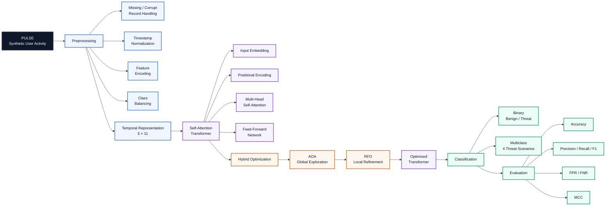

# DMA-PULSE

### Scenario-Driven Insider Threat Detection Using Dual Modelling Architecture

> **Published research** — a hybrid Transformer-based framework combining self-attention and metaheuristic optimization for scenario-driven insider threat detection.

[](#)
[](#)
[](#)
[](#)
[](#)

## Overview

DMA-PULSE proposes a **Dual Modelling Architecture (DMA)** for detecting anomalous insider activity from scenario-driven user behavior sequences. The framework combines a self-attention Transformer with a two-stage metaheuristic optimization strategy: **Archimedes Optimization Algorithm (AOA)** for global exploration followed by **Red Fox Optimization (RFO)** for local refinement.

The experiments use **PULSE (Profile-based User Logs for Synthetic Evaluation)**, a synthetic scenario-driven insider-activity dataset designed to represent benign, suspicious, and malicious user behavior. The published study evaluates both binary insider-threat detection and multiclass discrimination across four threat scenarios. fileciteturn65file0L9-L29

## Architecture



The architecture follows the methodology described in the paper: preprocessing and representation learning are followed by self-attention Transformer modeling, sequential AOA→RFO optimization, and final classification. fileciteturn65file0L108-L116

## Dataset

PULSE contains **14,010 activity sequences**, represented using **5 sequential time steps and 11 final feature dimensions** after preprocessing. The features encode user behavior, access context, activity, resource usage, temporal information, and other operational signals. fileciteturn65file0L120-L143

The paper describes binary labels for benign versus insider activity and four multiclass threat categories based on logon/logoff frequency, file access activity, removable-media usage, and process execution. Class imbalance is addressed through oversampling of minority classes and controlled undersampling of majority classes. fileciteturn65file0L140-L148

The raw dataset itself is **not included in this repository**. The repository documents the published experimental setup and is structured to avoid distributing unverified or unpublished data artifacts.

## Methodology

### 1. Data preprocessing

The published workflow includes handling incomplete or corrupted records, timestamp normalization, user-identity mapping, categorical encoding, and Min-Max normalization. The processed dataset is represented as a tensor with shape **[14010, 5, 11]**. fileciteturn65file0L150-L169

### 2. Self-attention Transformer

The model uses input embedding, positional encoding, multi-head self-attention, and feed-forward processing to learn temporal and contextual relationships across user activity sequences. The paper describes query/key/value attention as the mechanism for dynamically weighting feature relationships. fileciteturn65file0L194-L208

### 3. Hybrid AOA–RFO optimization

The optimization stage uses a sequential two-phase strategy:

- **AOA:** global exploration of the hyperparameter space, including parameters such as learning rate, attention heads, embedding size, and dropout.
- **RFO:** local refinement of the AOA-derived search region, including batch size, layer depth, and attention-head scaling factors.

The objective is to balance global exploration and local exploitation during Transformer tuning. fileciteturn65file0L209-L226

### 4. Classification

The final model supports both binary insider-threat classification and multiclass classification across four scenario categories. The reported evaluation includes accuracy, precision, recall, F1-score, false-positive rate, false-negative rate, and Matthews correlation coefficient. fileciteturn65file0L227-L234

## Published Results

The results below are **reported in the published paper** and are not presented as newly reproduced benchmarks in this repository.

| Evaluation | Reported result |
|---|---:|
| Binary accuracy | **97.62%** |
| Binary precision | **98.84%** |
| Binary detection rate / macro recall | **90.90%** |
| Binary false-positive rate | **0.33%** |
| Binary false-negative rate | **9.10%** |
| Multiclass accuracy | **97.67%** |
| Multiclass precision | **97.70%** |
| Multiclass detection rate / macro recall | **97.67%** |

The paper reports strong class-level F1 scores in both binary and multiclass settings and evaluates false-positive and false-negative behavior across the four multiclass scenarios. fileciteturn65file0L249-L275

### Comparison with reported baselines

The paper's comparative analysis reports the proposed approach at **97.67% accuracy**, compared with 95.2% for Random Forest, 90.6% for LSTM, 94.7% for RNN, 96.61% for an attention-based method, and 96.3% for ANN in the cited comparison table. fileciteturn65file0L376-L397

## Research Scope

DMA-PULSE focuses on the intersection of:

- Insider threat detection
- Behavioral cybersecurity analytics
- Temporal user-activity modeling
- Self-attention Transformers
- Metaheuristic optimization
- Scenario-driven synthetic security data

## Limitations and Future Work

The published study notes that the current evaluation is based on static datasets rather than streaming operational data. The paper identifies streaming-data extension and adversarial robustness as directions for future work. fileciteturn65file0L401-L419

## Publication

**Scenario Driven Insider Threat Detection Using Dual Modelling Architecture**

Authors: P. Lavanya, Pullela Vaishnavi, **Pullela Giridhar**, H. Anila Glory, V. S. Shankar Sriram. fileciteturn65file0L2-L8

Published in **Artificial Intelligence and Sustainable Computing — Proceedings of ICSISCET 2025**, Springer Lecture Notes in Networks and Systems (LNNS).

**DOI:** `10.1007/978-3-032-23945-7_11`

## Citation

```text
Lavanya, P., Vaishnavi, P., Giridhar, P., Glory, H.A., Sriram, V.S.S.
Scenario Driven Insider Threat Detection Using Dual Modelling Architecture.
Artificial Intelligence and Sustainable Computing, Springer LNNS.
DOI: 10.1007/978-3-032-23945-7_11
```

## Author

**Pullela Giridhar** — cybersecurity and AI-security researcher.
